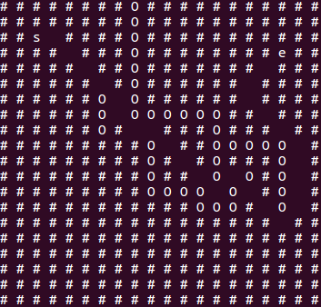

# A Star Algorithm 
A simple demo for beginner。
## python
### How to run it
`cd python/`

`python main.py`

You will get the result as follow.

description:
- '#' is grid for path planning
- 's' is the start point
- 'e' is the end point
- 'O' represents obstacle

# FAQ
- why the path isn't straight?

In this program, the cost from (1, 1) to (1, 2) is equal to from (1, 1) to (2, 2)